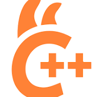

# Why Not llama-server: Making GLM-OCR Embeddable

本文记录 GLM-OCR-GGUF 项目中的第一步，路线选择：**将llama-server + mmproj 要改成 ONNX vision + llama.cpp ctypes 直调**。

llama-server 基线
web server 嵌入
q4的Encoder.onnx
onnx 与llama.cpp的特点
参考记录：

- opencode `ses_1787239e8ffehNckZPK6etlogO`: Find GLM-OCR GGUF and mRoPE support
- opencode `ses_15a2a6bc0ffe1icaU1zLeNHRfr`: Debug GLM-OCR ctypes embd mRoPE
- opencode `ses_1796eededffezn1I53DOJXDC0G`: 优化视频理解项目-glmocr-纯onnx推理
- 当前仓库：`runtime/glm_ocr_llama.py`、`runtime/glm_ocr_onnx.py`、`bin/llama_wrap.c`

---

## 1. 起点：llama-server + mmproj 是正确基线

llama-server，因为它是一个很重要的正确性基线：

```mermaid
GLM-OCR GGUF + mmproj GGUF + llama-server
```

当这条路线能正确识别测试图时，说明：

1. 官方 GGUF decoder 权重没问题。
2. llama.cpp 对 GLM-OCR / GLM4V 的 mRoPE 支持没问题。
3. mmproj 路径输出的 image embeddings 能被 decoder 正确消费。
4. 如果后续 ONNX + ctypes+llama.cpp的流程出乱码，不能先怪模型本身。

**所以错误一定在我们自己的部分，例如 ONNX 视觉侧、embedding 注入、batch 构造或 mRoPE 位置。**

---

## 2. 为什么不能用 llama-server

因为llama-server 适合“快速验证模型可用”，但不适合嵌入 VidGo / 本地视频理解系统。

### 2.1 独立llama server进程不适合嵌入web服务。

llama-server 是一个常驻 HTTP 服务：

```text
Python 调用方
  -> HTTP request
  -> llama-server
  -> mmproj vision
  -> GGUF decoder
  -> HTTP response
```

对单次 CLI demo 来说没问题，但嵌到视频理解系统后会遇到几个现实问题：

| 问题 | 影响 |
|---|---|
| 需要额外管理 server 生命周期 | 启动、端口、崩溃重启、日志都要接管 |
| HTTP API 增加状态边界 | 调用方无法细粒度控制 KV、context、batch |
| 图像输入必须走 server 的多模态接口 | 视觉侧不能替换成自己的 ONNX pipeline |
| 批量/缓存策略受 server 封装限制 | VidGo 里想复用上下文、批量 OCR、清理 KV 都不直接 |

VidGo 后端的调用点在同一个 Python 进程里，需要直接拿到 OCR 函数返回值、异常、模型路径和 context 生命周期。因此更合适的接口形态是：

```python
ocr = GlmOcrLlama(onnx_dir=..., gguf_path=...)
text = ocr.ocr_batch([image])[0]
```

而不是把同一张图再base64序列化成 HTTP 请求，交给另一个常驻 server 进程处理。


### 2.2 绕开 llama mmproj相对薄弱的vit支持和系统依赖较重的mtmd.so

mmproj 本质上做的是：图片 → vision encoder → projector → float embeddings。这恰好就是 ONNX 视觉侧做的事：
mmproj 路径:  PIL Image → libmtmd → GGUF vision weights → embeddings
ONNX 路径:    PIL Image → ONNX Runtime → ONNX vision weights → embeddings
用 ONNX 替代的好处：
- 不需要编译/分发 libmtmd.so
- 可以独立量化视觉侧（Q4 encoder）
- 可以优化 ONNX graph（融合、剪枝）
- 不受 llama.cpp 的 mmproj 支持进度限制

### 2.3 注意llama-server不能验证的产物

llama-server 能正确识别图片，只能证明下面这条链路是正确的：

```text
image
  -> llama.cpp clip.cpp / mtmd
  -> mmproj GGUF
  -> internal image embeddings
  -> GLM-OCR GGUF decoder
```

它没有加载、执行或验证这些文件：

```text
vision_encoder_q4.onnx
vision_encoder_q4.onnx.data
embed_tokens_q4.onnx
embed_tokens_q4.onnx.data
merger_fp16.onnx
merger_fp16.onnx.data
```

而当前混合 runtime 实际执行的是另一条链路：

```text
image
  -> ONNX Runtime vision_encoder
  -> ONNX merger
  -> ONNX embed_tokens
  -> ctypes 注入 embeddings
  -> GLM-OCR GGUF decoder
```


### 2.4 llama server的效率与ONNX + llama.cpp互有高下

两者在同样尺寸的图片下，直接对比：

| 图片 | ONNX + llama.cpp | llama-server |
|---|---:|---:|
| 简单文本 640x240 | 0.58s | 0.06s |
| 图表 4214x6318 | 1.29s | 1.69s |

简单解释

1. 简单小图时，llama-server 已经常驻，mmproj 路径很短，HTTP 开销也很小；而混合 runtime 如果包含 ONNX session / context 初始化，首帧会吃亏。
2. 复杂大图时，混合 runtime 的视觉侧走 Q4 ONNX，server 侧走 mmproj GGUF；视觉编码开销开始变重要，ONNX Q4 路径反而更快。
3. 两边 LLM decoder 都是 llama.cpp + GLM-OCR GGUF，主要差异不在文本 decoder，而在视觉侧和调用封装。

这也是为什么后续优化重点不是“让 ctypes 路线看起来更像 server”，而是把混合 runtime 的初始化成本移出单次调用，并明确区分 cold start 和 hot path。


---

确定了路线之后，ctypes 直调遇到的两个技术坑——mRoPE position layout 和 struct-by-value ABI——分别在后续两篇展开：

- **[02: Debugging mRoPE Embedding Injection](02_Debugging_mRoPE_Embedding_Injection.md)**：ONNX vision 输出正确、text embedding 正确，但端到端乱码。根因是 image embeddings 进入 llama.cpp 的 mRoPE position 布局不等价于 `mtmd-helper`。
- `llama_wrap.c` 的防御性 wrapper：——原来从 MiniCPM-V 复用，后续验证发现直接 ctypes 构建 struct by value 也可工作，wrapper 不是严格必需的。

---


## 3. 最终路线
onnx处理Encoder和merger部分，llama处理自回归。

<table>
<tr>
<td></td>
<td></td>
</tr>
</table>


```text
PIL Image
  -> GlmOcrOnnx._preprocess_image()
  -> ONNX vision_encoder
  -> ONNX merger
  -> ONNX embed_tokens
  -> 构造 image token 替换后的 inputs_embeds
  -> 按 llama.cpp mtmd-helper 规则构造 4D mRoPE batch
  -> llama_decode()
  -> greedy decode
```

这条路线比 llama-server 麻烦，但换来的是：

1. 不需要 HTTP server。
2. 不需要 server 进程生命周期管理。
3. ONNX 视觉侧可以自己导出、优化、量化。
4. Python runtime 可以直接嵌进 VidGo等网络服务中。
5. 上层可以控制 context / KV / batch / prompt。

---

## 4. 结论（经验）

llama-server 虽然不是项目的目标产物，却可以作为测试导出模型的**正确性基线**。

所以工程路线是：

```text
先用 llama-server 证明 GGUF decoder + mRoPE 是对的
再用 ctypes 复刻 llama.cpp mtmd-helper 的 embedding batch 语义
最后把视觉侧替换成可控的 ONNX Runtime pipeline
```

如果一开始没有 llama-server 这个基线，ONNX 输出、tokenizer、prompt、mRoPE、ctypes ABI、decoder 量化都会混在一起，很难定位问题。
